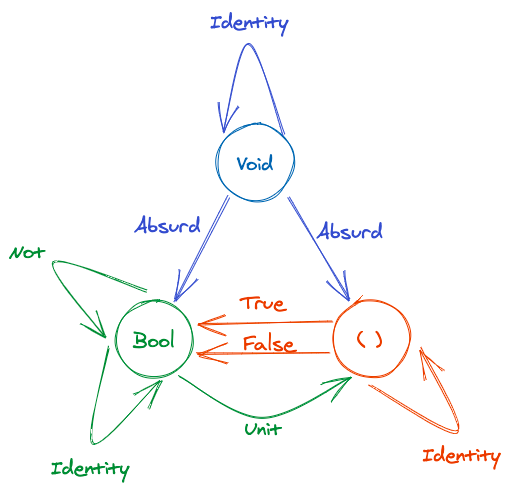

# [Category Theory for Programmers](https://github.com/hmemcpy/milewski-ctfp-pdf)

Notes from book club, using a Kotlin point-of-view.

## [Chapter 1] Category: The Essence of Composition

- `Morphisms` can be thought of as "arrows" or functions
    - `f = A => B` and `g = B => C`, therefore you can write a function that composes `f` and `g` to get `A => C`
    - Composition in math is written right to left as `𝑔 ∘ 𝑓` or "g after f"
    - ```kotlin
      val f: (a: A) -> B
      val g: (b: B) -> C
      val g_after_f: (a: A) -> C = g(f(a))
      ```
    - ```haskell
      f :: A -> B
      g :: B -> C
      g.f  
      ```
        - `::` means "has type of"
        - `.` means composition
- Composition is associative, so with three morphisms `f`, `g`, and `h`: `(h.g).f = h.(g.f) = h.g.f`
- Every object has a unit arrow, e.g. a function that starts with A and ends with A
    - This is called "identity on A": `𝑓 ∘ id𝐴 = 𝑓` and `id𝐵 ∘ 𝑓 = 𝑓`
    - This also means that the identity arrow is same for every type
    - ```kotlin
      fun <T> id(t: T): T = t
      ```
    - ```haskell
      id :: a -> a
      id x = x
    
      f.id == f 
      id.f == f
      ```
- Higher order functions are the algebra of functions
- "We often describe some piece of code as elegant or beautiful, but what we really mean is that it’s easy to process by
  our limited human minds"
    - "The idea is that, once a chunk is implemented, we can forget about the details of its implementation and
      concentrate on how it interacts with other chunks."
- In Category Theory all you can ever really know is how entities connect to other entities through arrows

### Challenges

1. Implement, as good as you can, the identity function in your favorite language
   ```kotlin
   fun <A> identity(a: A): A = a
   
   val identity: (String) -> String = ::identity
   ```
2. Implement the composition function in your favorite language. It takes two functions as arguments and returns a
   function that is their composition.
   ```kotlin
   infix fun <A, B, C> ((B) -> C).compose(f: (A) -> B): (A) -> C = { this(f(it)) }
   
   val f: (Int) -> String = { it.toString() }
   val g: (String) -> Double = { it.toDouble() }
   val h: (Double) -> Float = { it.toFloat() }
   val g_after_f: (Int) -> Double = g compose f
   val h_after_g_after_f: (Int) -> Float = h compose g compose f
   ```
3. Write a program that tries to test that your composition function respects identity.
   ```kotlin
   val f1: (String) -> String = { it }
   val f2: (String) -> String = f1 compose identity
   val f3: (String) -> String = identity compose f1
   ```
4. Is the world-wide web a category in any sense? Are links morphisms?  
   There is some sense if you treat it just as "a path to". Refreshing could be the identity morphism. But, in another
   perspective, every page probably doesn't contain a link to itself. Links A -> B -> C does not necessarily mean a page
   has a link A -> C. Depends on how we define it.
5. Is Facebook a category, with people as objects and friendships as morphisms?  
   Since "friendship" is the morphism, then A friends with B friends with C does not imply A friends with C.
6. When is a directed graph a category?  
   Basically when it looks
   like [this](https://upload.wikimedia.org/wikipedia/commons/thumb/f/ff/Category_SVG.svg/2560px-Category_SVG.svg.png).
   You need each node to have an edge back to itself and for each node it connects to, we also need connections to that
   node's connections.

## [Chapter 2] Types and Functions

- Category theory is about composing arrows, the target of one arrow is the source of another
- "It’s a common practice in Haskell to start a project by designing the types."
- "Types" are a set of values: Boolean is the set of `true` and `false`, Char is the set of all unicode characters
    - They can be finite or infinite, e.g. String is an infinite set
    - `val x: Int` x is an element of the set of integers (in Haskell this set is infinite)
- In the set `Set`, objects are sets and morphisms (arrows) are functions
    - Some properties we know:
        - Empty set is no elements
        - There are special one element sets
        - Functions map elements from one set to another
        - Two elements can map to one
        - One element cannot map to two
        - Identity maps to itself
- The `bottom` denoted by `_|_` or `⊥` corresponds to a non-terminating computation (think Halting Problem)
    - `f :: Bool -> Bool` or `val f: (Bool) -> Bool` may return `true`, `false`, or `_|_` (it never terminates)
    - Once the `bottom` is treated as part of the type system, every runtime error can be modeled as such - we can even
      return them
        - In Haskell we can return bottom explicitly as `undefined`, the following is okay because `undefined` is a
          member of any type:
        ```haskell
        f :: Bool -> Bool
        f x = undefined
        ```
    - Functions that may return bottom are called `partial` as opposed to `total` which return valid results for every
      possible argument
    - Because of bottom, the category of Haskell types and functions are called `Hask` rather than `Set`, to be
      practical, ignore non-terminating functions and bottoms and treat `Hask` as `Set`.
- In `denotational semantics` every programming construct has a mathematical interpretation, and properties of programs
  can be proven with a mathematical theorem
    - `fact n = product [1..n]` defines a factorial function in Haskell
        - `[1..n]` is a list of integers from 1 to n, `product` multiplies all elements of a list
    - So what would be the mathematical model for "reading a character from the keyboard"?
    - Having a mathematical model for programming means we can define formal proofs about the correctness of software
- Since a mathematical function just maps values to values, it will do the same thing every time
    - A function with side effects cannot be easily modelled as a mathematical function
    - A function is `pure` when there are no side effects - in Haskell all functions are pure
- What is the type for an empty set? In Haskell this is called `Void` (different from C++ void)
    - If you define a function that accepts `Void`, you can never call it, because to call it you must provide a value,
      and there are no values for `Void`
        - This function could return anything because it can't be called: `absurd :: Void -> a` in Haskell
            - `val absurd: (Nothing) -> Any?` in Kotlin?
- What is the type for a singleton set? In C++ this is `void` - the value just "is"
    - A function "from" void will always return the same result (if it is pure): `val fn: () -> Int = { 42 }`
    - This is **not** a function that takes "nothing", a function that takes "nothing" cannot be called!
    - In Haskell the symbol for this "dummy" value of which there is only one instance is `()`: `fn :: () -> Integer`
        - This is called the unit value
        - We can think of the above `fn` as a different representation of the number `42`
    - This is how we can convert explicit mentions to elements to functions instead
        - Functions "from" unit any type A are in "one-to-one correspondence" with elements of the set A
    - A pure function that returns unit does nothing, in C++ a function that returns void is used for side effects
        - The argument simply gets discarded
        ```haskell
        fInt :: () -> Integer
        fInt x = ()
        ```
        - We can define a polymorphic version:
        ```haskell
        unit :: a -> ()
        unit _ = ()
        ```
        ```kotlin
        fun <T> unit(t: T): Unit
        ```
- The two-element set in Haskell is called `Bool`, we can define this as enums in other languages
    - ```haskell
      data Bool = True | False
      ```
    - ```kotlin
      enum class Bool { TRUE, FALSE }
      ```
    - Functions "to" bool are called "predicates"
        - `Char` has a ton of them like `isDigit`, `isAlpha`, etc.

### Challenges

1. Define a higher-order function (or a function object) memoize in your favorite language. This function takes a pure
   function f as an argument and returns a function that behaves almost exactly like f, except that it only calls the
   original function once for every argument, stores the result internally, and subsequently returns this stored result
   every time it’s called with the same argument. You can tell the memoized function from the original by watch- ing its
   performance. For instance, try to memoize a function that takes a long time to evaluate. You’ll have to wait for the
   result the first time you call it, but on subsequent calls, with the same argument, you should get the result
   immediately.
   ```kotlin
   class Memoize<in A, out B>(val f: (A) -> B) : (A) -> B {
       private val memoized = mutableMapOf<A, B>()
       override fun invoke(a: A): B = memoized.getOrPut(a) { f(a) }
   }
    
   fun <A, B> ((A) -> B).memoize(): (A) -> B = Memoize(this)
   fun <A, B> memoize(f: (A) -> B): (A) -> B = Memoize(f)
   ```
2. Try to memoize a function from your standard library that you normally use to produce random numbers. Does it work?  
   This doesn't work because random is not pure, we can't map input to output since the output is (ideally) different.
3. Most random number generators can be initialized with a seed. Implement a function that takes a seed, calls the
   random number generator with that seed, and returns the result. Memoize that function. Does it work?
   ```kotlin
   val randomSeed: (Int) -> Int = { (0..100).random(Random(it)) }
   val randomSeedMemoized = randomSeed.memoize()
   ```
   I suppose so, we can now map an `Int` (seed) to a deterministic value.
4. Which of these C++ functions are pure? Try to memoize them and observe what happens when you call them multiple
   times: memoized and not.
    - A. The factorial function from the example in the text.
    - B. `std::getchar()`
    - C. `bool f() { std::cout << "Hello!" << std::endl; return true; }`
    - D. `int f(int x) { static int y = 0; y += x; return y; }`

   Only `A` is a pure function. B relies on state from `stdin`, C produces a side effect `std::cout`, and D does both by
   producing a side effect `y += x` and relying on state `static int y`
5. How many different functions are there from Bool to Bool? Can you implement them all?  
   Four different functions exist. Or is it two because always true / false is `() -> Boolean`?
   ```kotlin
   val identityBoolean: (Boolean) -> Boolean = { it }
   val inverseBoolean: (Boolean) -> Boolean = { !it }
   val alwaysTrue: (Boolean) -> Boolean = { true }
   val alwaysFalse: (Boolean) -> Boolean = { false }
   ```
6. Draw a picture of a category whose only objects are the types Void, () (unit), and Bool; with arrows corresponding to
   all possible functions between these types. Label the arrows with the names of the functions.  
   https://excalidraw.com/#json=5715022994997248,VBDtz-52M7fFKMFlqwqFXQ  
   

## [Chapter 3] Categories Great and Small

- The empty category is one with zero objects and zero morphisms
- "Every time you add a new arrow, you have to also consider its composition with any other arrow (except for the
  identity arrows) and itself. You usually end up with infinitely many arrows, but that’s okay."
- This kind of category is called a "free category"
- If `𝑎 ⩽ 𝑏` and `𝑏 ⩽ 𝑐` then `𝑎 ⩽ 𝑐` then this set is called a "preorder" and is a category
    - Additionally, if `𝑎 ⩽ 𝑏` and `𝑏 ⩽ 𝑎` then `𝑎 == 𝑏`, this is called "partial order"
    - If any two objects are in relation with each other, this is a "linear order" or "total order"
- Preorder: Category where there is at most one morphism going from any object a to any object b
    - This is a "thin category"
- A set of morphisms from object _a_ to object _b_ in a category C is called a "hom-set"
    - Written as `𝐂(𝑎, 𝑏)` or `Hom𝐂(𝑎, 𝑏)`
    - Every hom-set in a preorder is empty or a singleton
        - `C(a,a)` is a singleton, it only contains the identity morphism
    - Cycles are allowed in a preorder, but forbidden in a partial order
- Orders are important because of sorting. Algos like quicksort, mergesort, etc only work on total orders
    - Partial orders can be sorted with something like topological sort
- Classically, a "monoid" is a set with a binary operation
    - The only requirement is that it is associative, and there is one element that behaves like unit
    - Natural numbers from zero are a monoid under addition: (a+b)+c = a+(b+c)
    - No requirement to be communicative - string concatenation is a monoid (neutral element is empty string)
    - Haskell has a type class for monoids. The neutral element is called `mempty` and the binary operation is
      called `mappend`
      ```haskell
      class Monoid m where 
        mempty :: m
        mappend :: m -> m -> m
      ```
    - The example of a String monoid
      ```haskell
      instance Monoid String where
        mempty = ""
        mappend = (++)
      ```
- Think of monoids as objects and morphisms where the binary operator moves things around the set
    - Ex. Adding 5 to every natural number, 0 to 5, 1 to 6, 2 to 7
    - For every natural number n there is a function of adding n, "the adder"
        - These adders compose, a function adding 5 composed with a function adding 7 adds 12.
- A monoid is a single object category
    - Think of the natural numbers as a single object with a bunch of morphisms (adders)
    - The source and target of these morphisms are the same object - natural number adders produce more natural numbers

### Challenges

1. Generate a free category from:  
   A. A graph with one node and no edges.  
   Add an identity arrow for the one node to itself.  
   B. A graph with one node and one (directed) edge (hint: this edge can be composed with itself)  
   Every node needs an identity arrow to itself, and since the edge can be composed with itself, we can have infinitely
   many composed morphisms.  
   C. A graph with two nodes and a single arrow between them.  
   Add an identity arrow for each node.  
   D. A graph with a single node and 26 arrows marked with the letters of the alphabet: a, b, c ... z.  
   Each node needs an identity arrow to itself - this will have infinitely many arrows
2. What kind of order is this:  
   A. A set of sets with the inclusion relation: 𝐴 is included in 𝐵 if every element of 𝐴 is also an element of 𝐵.  
   Preorder  
   B. C++ types with the following subtyping relation: T1 is a subtype of T2 if a pointer to T1 can be passed to a
   function that expects a pointer to T2 without triggering a compilation error.  
   TODO
3. Considering that Bool is a set of two values True and False, show that it forms two (set-theoretical) monoids with
   respect to, respectively, operator && (AND) and || (OR).  
   We need to have associativity and the special element. Both && and || are associative: (a && b) && c = a && (b && c),
   (a || b) || c = a || (b || c). "True" is the special element for &&, and "False" is the special element for ||.
4. Represent the Bool monoid with the AND operator as a category: List the morphisms and their rules of composition.
    - id = (AND True)
    - id . (AND False) = (AND False)
    - (AND False) . (AND False) = (AND False)
    - (AND False) . id = (AND False)
    - id . id = id
5. Represent addition modulo 3 as a monoid category.  
    TODO()
